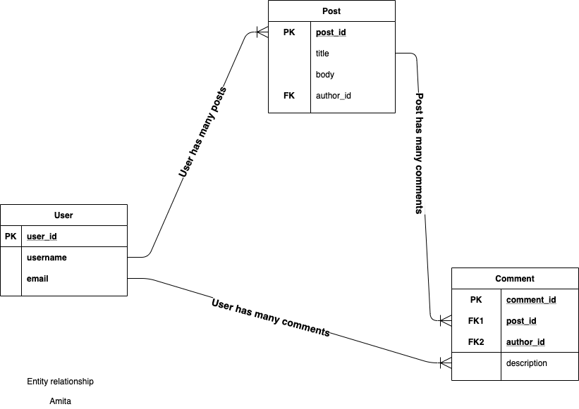

# Active Records Model of Micro-Reddit

This project was used to get our feets wet working on database model using Rails powerful ORM called Active Records.
The data structures necessary to support link submissions and commenting on Reddit was the main focus of this project



## Built With

- Ruby on Rails
- Ruby

# Getting Started

To get a local copy of the repository please run the following commands on your terminal:

```
$ cd <folder>
```

```bash
$ git clone `git@github.com:ahmadchata/rails_micro_reddit.git`
$ cd rails_micro_reddit
$ bundle install
$ yarn install --check-files
$ Run `rails db:migrate` to create necessary tables in database
```

# Authors

👤 **Ahmad Chata**

- Github: [@Ahmad](https://github.com/ahmadchata)
- Twitter: [@Ahmad](https://twitter.com/AhmadChata)
- Linkedin:[@Ahmad](http://linkedin.com/in/ahmad-chata-957b9b51)

👤 **Amita Roy**

- Github:[@Amita](https://github.com/Amita-Roy)
- Twitter:[@Amita](https://twitter.com/AmitaRoy14)
- Linkedin:[@Amita](https://www.linkedin.com/in/amita-roy-3b823b68/)

## 🤝 Contributing

Contributions, issues and feature requests are welcome!

## Show your support

Give a ⭐️ if you like this project!
